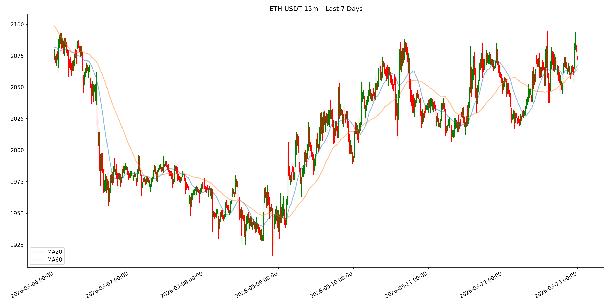
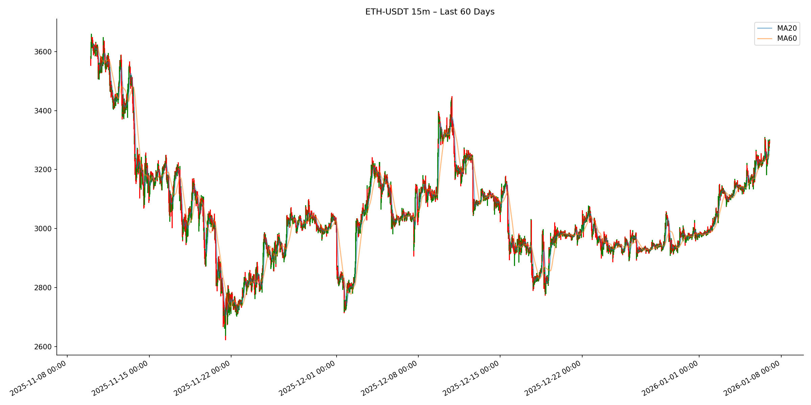
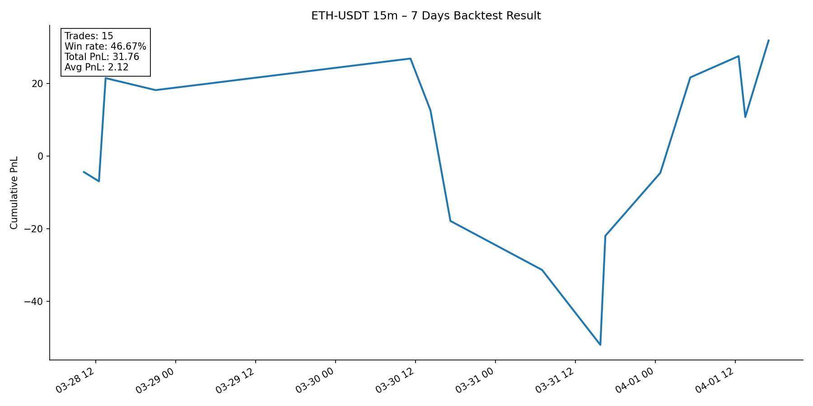

# ETH Binance Sqaure Project

## Price Visualization Results

### Last 7 Days

---

### Last 60 Days

---

### Last 7 Days Backtest

## Overview
This repository presents a quantitative trading strategy applied to **ETH-USDT**
using historical Binance data.

- Timeframe: **15-minute bars**
- Indicators: **MA20 / MA60**
- Strategy type: **Trend-following with structural filtering**
- Backtest scope: **Full historical period**

---

## Strategy Logic
**Entry**
- MA20 crosses above MA60
- Price remains above the most recent support zone

**Exit**
- MA20 crosses below MA60, or
- Price breaks below the support zone

---

## Notes
- The equity curve represents cumulative PnL without leverage or transaction costs.
- This project is intended for research and educational purposes only.

---

## Disclaimer
This code does not constitute financial advice.
